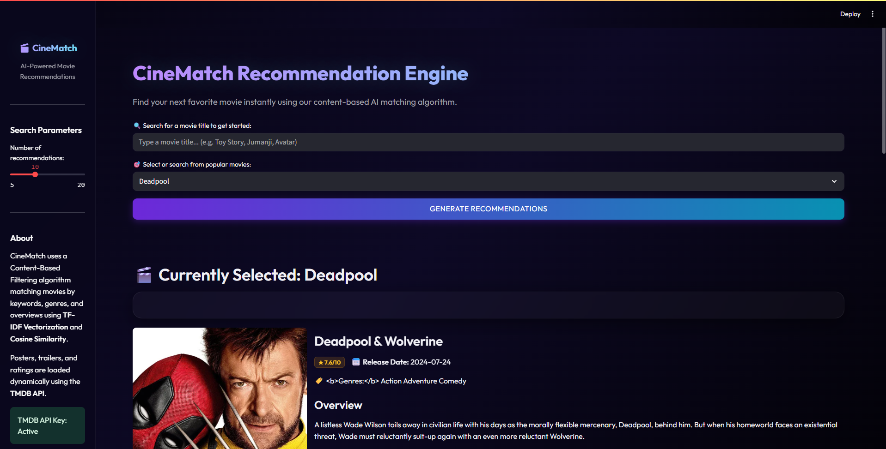
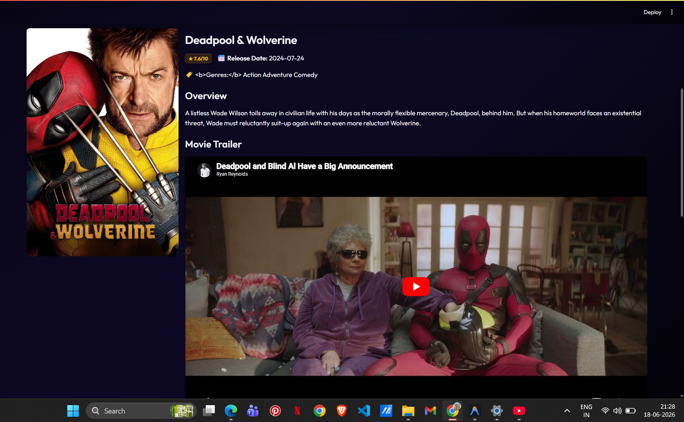
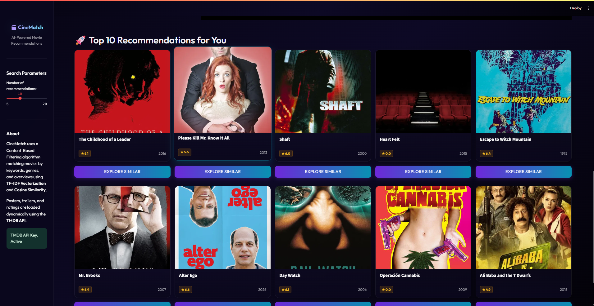

# 🎬 Movie Recommendation System

A content-based Movie Recommendation System built using Python, Natural Language Processing (NLP), Machine Learning, and Streamlit. The system recommends similar movies based on content features such as genres, keywords, cast, crew, and movie descriptions.

## 🚀 Features

* Content-based movie recommendations
* Interactive Streamlit web interface
* NLP-based text preprocessing
* TF-IDF Vectorization for feature extraction
* Cosine Similarity for movie matching
* Fast and relevant movie suggestions

## 🛠️ Technologies Used

* Python
* Pandas
* NumPy
* Scikit-learn
* NLP
* Streamlit
* TF-IDF Vectorization
* Cosine Similarity

## 📊 Dataset

The project uses movie metadata datasets containing:

* Movie Titles
* Genres
* Keywords
* Cast
* Crew
* Movie Overviews

## ⚙️ How It Works

1. Load and preprocess movie datasets.
2. Merge important movie features into a single text representation.
3. Apply NLP preprocessing and TF-IDF Vectorization.
4. Compute similarity scores using Cosine Similarity.
5. Select a movie from the Streamlit interface.
6. Generate and display top recommended movies.

## 🎯 Project Objective

To build an intelligent recommendation system that helps users discover movies similar to their interests using Machine Learning and NLP techniques.

## 📷 Application Interface

The Streamlit-based interface allows users to:

* Search and select movies.
 
* Receive personalized movie recommendations.
  
* View recommendations instantly through an interactive web application.
  

## 🔮 Future Enhancements

* Hybrid Recommendation System
* Collaborative Filtering
* Movie Posters and Ratings Integration
* User Authentication
* Personalized User Profiles

## 👨‍💻 Author

Sumit Mathpal

